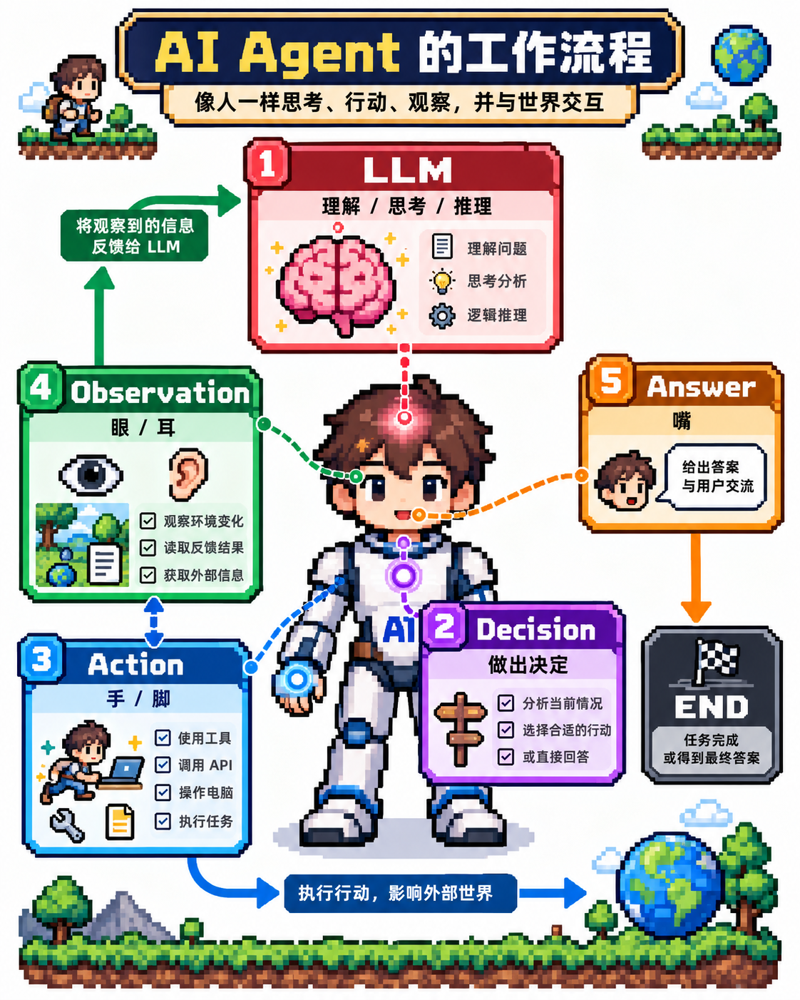

# Lesson 00 — The Anatomy of an Agent

<p align="center">
  
</p>

> **Agent 到底是什么？**

在开始写 Agent 之前，我们先回答一个最基本的问题：

**什么是 Agent？**

先不谈框架、MCP、RAG、Memory。

我们从 SHELL 开始。

---

## 0. Shell
在没有 LLM 之前，我的依靠的自己的大脑控制自己的使用工具

我们需要的是使用的工具是 **Shell**。

**终端**是输入命令、查看结果的窗口。是我们人家交互的第一个工具。接受我们的指令，返回我们结果。

第一个命令如下：
```
who
```

who 命令会返回当前是谁在使用终端，这就是反馈了。

我们是工具的使用者，我用了我自己的大脑控制我自己的双手使用了工具。

这里有三个概念： 大脑 双手 工具。

大脑思考我们自己的意图 利用双手 使用工具 给出反馈。

这就是一次反馈循环，就像我们在钢琴上按下按琴键，琴键敲击琴弦，发出声音。如此往复下去。就能得到一首曲子。

接下来，我在想这样一件事，要是有人可以替代我的思考就好了。双手 工具 反馈都不需要变动。

## 1. LLM 会思考，但不会行动

> *没有所指(Signified)的能指没有意义，而没有能指(Signifier)的所指则无法想像*
>
> —— 索绪尔


我们会有一个念头，念头来自大脑中的想象，这些想象的载体是声音。声音符号最后体现为文本。我们思考的过程就是不断生成念头->声音->文本的过程，而LLM 正是很好的模拟了这一过程。

这就可以构成一个最简单的大语言模型应用。它大概是这样的：

```text
User
  ↓
 LLM
  ↓
Answer
```

比如你问：

```text
当前目录有哪些文件？
```

LLM 知道可以执行：

```bash
ls
```

但它并没有真的执行 `ls`。

它只是告诉你应该怎么做。

如果把 LLM 想象成一个人：

```text
     🧠 LLM
        ↓
     👄 Answer
```

它有**大脑**，也有**嘴巴**，会思考，会回答。

但不会真正行动。

这种问答过程很有用，像极了我们的思考。但它还不是我们这套教程想研究的 Agent。

因为它只能：

> **回答问题。**

它不能真正去做事情。它目前只是替换我们的大脑。接下来我们需要给它可以一双手。

---

## 2. 如果给 LLM 一双手呢？

现在，我们给 LLM 一个工具：

```text
bash
```

LLM 就可以决定：

```text
执行 ls
```

程序真正执行：

```bash
ls
```

得到：

```text
README.md
agent.sh
lesson-00.md
```

结果再交给 LLM。

这时候，LLM 不再只是告诉你：

> 应该怎么做。

而是可以：

> **决定做什么，并通过工具真正行动。**

如果把 Agent 想象成一个人：

```text
                       🧠 LLM
                          │
                          ↓
                     🧠 Decision
                      ╱        ╲
                     ↓          ↓
                👐 Action    👄 Answer
                     │          │
                     ↓          ↓
              👀 Observation   🛑 END
                     │
                     └────────→ 🧠 LLM
```

对应关系很简单：

| Agent | 人 |
| --- | --- |
| LLM | 🧠 大脑 |
| Decision | 🧠 决策 |
| Action | 👐 手脚 |
| Observation | 👀👂 眼睛、耳朵 |
| Answer | 👄 嘴巴 |
| END | 🛑 结束 |

所以：

> **LLM 是 Agent 的大脑，但 LLM 不等于 Agent。**

---

## 3. Agent Loop

把人的比喻拿掉，就是 Agent 最核心的结构：

```text
              Agent Loop

       ┌───────────────────────┐
       │                       │
       ↓                       │
     LLM                       │
       ↓                       │
   Decision                    │
    ╱     ╲                    │
   ↓       ↓                   │
Action    Answer               │
   │       │                   │
   ↓       ↓                   │
Observe   END                  │
   │                           │
   └───────────────────────────┘
```

如果任务还没有完成：

```text
LLM
 ↓
Decision
 ↓
Action
 ↓
Observation
 │
 └────────→ LLM
```

Agent 根据新的 Observation，再决定下一步做什么。

如果任务已经完成：

```text
LLM
 ↓
Decision
 ↓
Answer
 ↓
END
```

退出 Loop。

这就是：

> **Agent Loop**

Agent 不需要一开始就知道完成任务的所有步骤。

它可以：

> **决定 → 行动 → 观察 → 再决定**

直到任务完成。

---

## 4. 从代码看 Agent Loop

对于程序员来说，这个结构其实非常熟悉：

```bash
while true; do

    # Decision

    # Action

    # Observation

done
```

一个最简化的 Agent Runtime，可以理解成：

```bash
while true; do

    # LLM 决定下一步

    if 需要行动; then
        # 执行 Tool
        # 获取 Observation
        # 回到 Loop
        continue
    fi

    # 输出 Answer
    break

done
```

所以：

> **Agent Loop，本质上真的可以从一个 `while` 开始。**

至于经典的 **ReAct**：

```text
Reason → Action → Observation → Reason → ...
```

可以把它理解为一种经典的 Agent 推理与行动模式。

但：

```text
Agent ≠ ReAct
```

我们真正关心的是背后的 **Loop**。

---

## 5. Agent 到底是什么？

到这里，可以先用一个简单的公式理解 Agent：

```text
Agent = LLM + Tools + Context + Loop
```

**LLM** 是大脑，负责理解和决策。

**Tools** 是手脚，让 Agent 能够行动。

**Context** 是 Agent 当前能够看到的信息。

**Loop** 把它们连接起来，让 Agent 根据环境反馈持续行动。

最终形成：

```text
              🔄 Agent Loop

       ┌────────────────────────┐
       │                        │
       ↓                        │
     🧠 LLM                     │
       ↓                        │
  🧠 Decision                   │
     ╱      ╲                   │
    ↓        ↓                  │
👐 Action   👄 Answer           │
    │        │                  │
    ↓        ↓                  │
👀 Observe   🛑 END             │
    │                           │
    └───────────────────────────┘
```

如果这一课只记住一句话：

> **Agent 的本质，是让模型能够在一个循环中，根据环境反馈持续决定下一步行动，直到任务完成。**

![[./assets/00-the-anatomy-of-an-agent.png]]
---

## 下一课

我们已经知道，Agent 最核心的结构是：

```text
Loop
```

而最简单的 Loop 就是：

```bash
while true; do
    ...
done
```

下一课，我们暂时连 LLM 都不要。

就从这个 `while` 开始，一点一点把它变成 Agent。

**Next: Lesson 01 — Start with a Loop**
