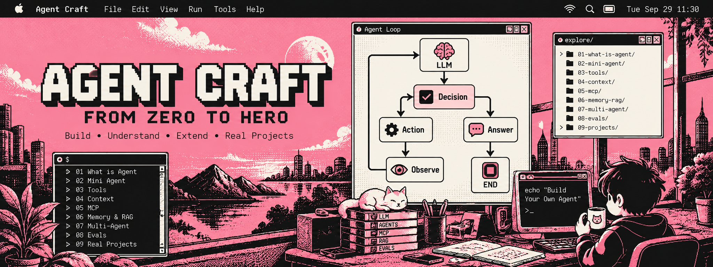

<p align="center">
  
</p>

# Agent Craft: From Zero to Hero

> *Stat rosa pristina nomine, nomina nuda tenemus.*
>
> 昔日的玫瑰芳香已逝，我们拥有的是空空的名字。
>
> —— 翁贝托·埃科《玫瑰的名字》结尾

从终端开始，亲手写出第一个 Agent，再用 Python 重建它，最后学习工程能力与现成框架。

这是一门循序渐进的动手课程。你会先看清 Agent 最核心的流程：**向模型提问 → 读取决策 → 执行工具 → 把结果交还模型 → 决定是否继续**。Part 0 会用 Bash、curl 和 jq 搭建一个最小 Coding Agent，先离线跑通循环，再接入真实模型；后面的课程再逐步补上工具管理、权限控制、可观测性和评测。

## 适合谁

- 想从零理解 Agent 如何工作，而不只会调用框架的人。
- 会使用电脑，熟悉终端、Bash 或 Python 的人。
- 已经写过 Agent，想弄清框架替自己处理了什么的人。

## 学习路线

```text
序章    Agent 的构成

  从 Shell 到 LLM，理解工具、反馈与 Agent Loop
                         ↓
Part 0  手搓第一个 Agent（Bash）
  Bash 基础 → JSON 与消息 → 本地工具 → 离线 Agent Loop → 接入模型 → 实战
                         ↓
Part 1  用 Python 重建
  09–13  重写循环 → Tool Registry → Context → Memory → Planning
                         ↓
Part 2  Agent 工程能力
  14–19  MCP → RAG → Human Approval → Multi-Agent → Tracing → Evals
                         ↓
Part 3  框架
  20–22  OpenAI Agents SDK → Microsoft Agent Framework → 对比手搓 Runtime
                         ↓
                       HERO
```

每课都采用同一种形式：**讲解、可运行代码、动手习题**。讲解说明为什么需要这一能力；代码给出可以亲自运行和修改的最小示例；习题让你在已有成果上加一小步。课程按顺序推进，前一课的成果会成为后一课的起点。

## 序章：Agent 的构成

阅读 [The Anatomy of an Agent](00-the-anatomy-of-an-agent/00-the-anatomy-of-an-agent.md)，从 Shell 与工具使用开始，理解 LLM 如何通过工具和反馈形成 Agent Loop，为后续动手实现打下基础。

## Part 0 手搓第一个 Agent（Bash）

不用 Agent 框架，用 Bash、curl 和 jq，从终端输入开始，逐步搭建一个能读写文件、修改文本、执行命令的最小 Agent。

### 学习目标

- 理解模型如何提出工具调用，以及本地脚本如何执行并回传结果。
- 掌握读懂 Agent 脚本所需的 Bash 语法与 JSON 操作。
- 实现四个本地工具，串起完整的 Agent Loop。
- 能运行脚本、解释各函数的职责，并追踪一次任务的完整执行过程。

### 教程与代码

| 资源 | 内容 |
| --- | --- |
| [Bash 入门教程](01-terminal-bash-agent/01-terminal-bash-agent.md) | 按先修关系安排的 20 课，包含讲解、可运行示例、练习与验收。第 01～19 课可离线学习，第 20 课接入真实模型。 |
| [完整 Agent 脚本](01-terminal-bash-agent/01-terminal-bash-agent.sh) | 使用 DeepSeek API 的 Mini Coding Agent，包含消息历史、四个工具和双层循环。 |

### 学习大纲

以下八个单元概括学习主线；教程课次对应上方文档中的编号。

| 单元 | 主题 | 核心内容 | 动手验收 | 教程课次 |
| --- | --- | --- | --- | --- |
| 0.1 | 认识 Agent 的工作流程 | 用户任务 → 模型决策 → 本地执行工具 → 回传结果 → 继续或结束；区分外层会话循环与内层任务循环。 | 画出执行流程，指出真正操作文件的位置。 | 05、17～18 |
| 0.2 | 掌握够用的 Bash 基础 | 命令、变量、引号、输入、条件、循环、函数、退出状态，以及命令替换、子 Shell、管道与重定向。 | 写一个持续接收任务的脚本，正确处理空行、`exit` 和 EOF。 | 01～09 |
| 0.3 | 用 jq 管理消息与 JSON | 解析响应，用 `--arg`、`--argjson` 构造 JSON，维护 `system`、`user`、`assistant`、`tool` 消息历史。 | 向历史追加消息，验证引号和反斜杠得到正确保留。 | 10～12 |
| 0.4 | 实现四个本地工具 | `read_file` 读取文件；`write_file` 创建或覆盖文件；`edit_file` 替换唯一匹配文本；`bash` 执行命令并返回输出与退出码。 | 验证读写、唯一替换，以及文件名不合法、匹配失败和命令失败时的行为。 | 13～15 |
| 0.5 | 打通工具调用协议 | 声明工具名称、用途与参数；解析 `tool_calls`；逐个执行调用；通过 `tool_call_id` 配对结果。 | 检查多个工具调用都生成对应的 `tool` 消息。 | 16、18～19 |
| 0.6 | 离线跑通 Agent Loop | 使用固定 JSON 模拟模型，串起请求工具、执行、回传和最终回答；设置最大轮数。 | 验证消息顺序、调用 ID、跨任务历史，以及达到上限后停止。 | 17～18 |
| 0.7 | 接入真实模型 | 检查依赖，用环境变量配置密钥与模型，通过 `curl` 请求 API，处理超时、HTTP 错误和响应解析失败。 | 完成一次真实请求，并验证缺少密钥时会在请求前退出。 | 19～20 |
| 0.8 | 完成第一个 Agent 实战 | 读取文件、修改指定文本、执行命令检查结果，沿数据流读懂完整脚本。 | 将 `hello.txt` 中的 `hello` 改为 `hi`，检查结果并解释每一步消息变化。 | 20 |

### 开始学习

1. 打开 [Bash 入门教程](01-terminal-bash-agent/01-terminal-bash-agent.md)，按照“开始前”建立专用练习目录。
2. 按教程第 01～20 课顺序练习，使用 `bash lesson-01.sh` 等命令运行示例。
3. 离线跑通工具调用闭环后，配置 `curl`、`jq` 与 `DEEPSEEK_API_KEY`，完成真实模型请求。
4. 将 [完整脚本](01-terminal-bash-agent/01-terminal-bash-agent.sh) 复制到练习目录，运行：

   ```bash
   printf 'hello agent\n' > hello.txt
   bash 01-terminal-bash-agent.sh
   ```

5. 依次输入以下任务，每次等待回复后再继续：

   ```text
   读取 hello.txt，告诉我内容。
   把 hello.txt 中的 hello 改成 hi，其他内容保持不变。
   运行 cat hello.txt，检查修改结果。
   exit
   ```

> **运行边界：** 文件名校验不是沙箱，`bash` 工具可以执行模型给出的任意命令。请在无敏感资料、文件可丢弃的受控练习环境中运行。学习时同时留意输出截断、命令替换丢失末尾换行，以及编辑写回并非原子操作等限制。

### 完成检查

- [ ] 能解释四种消息角色，以及工具调用与结果如何配对。
- [ ] 能指出模型提出调用、本地执行工具、结果写入历史的代码位置。
- [ ] 能解释外层循环与内层循环各自的职责和退出条件。
- [ ] 能完成读取、修改、检查文件的实战任务，并核对实际文件内容。
- [ ] 能说明这个教学实现的能力边界，而不把它当作安全沙箱。

## Part 1 — Rebuild It in Python 🐍

目标：保留同一条 Agent 主线，用更容易扩展和检查的代码重新实现。

| 课次 | 主题 | 讲解与可运行代码 | 动手习题 |
| --- | --- | --- | --- |
| 09 | Python 重写 Bash Agent | 用 Python 重建模型请求、Decision、工具调用与循环，对照 Bash 版本。 | 用同一任务运行两个版本，比较每轮行为。 |
| 10 | Tool Registry | 集中登记工具的名称、说明和调用方式。 | 注册一个新工具，并验证未知工具名会被拒绝。 |
| 11 | Context | 组织系统指令、用户任务、工具结果与历史消息，控制送入模型的内容。 | 记录一次任务的上下文，并删去不必要的历史信息。 |
| 12 | Memory | 区分单次任务上下文和跨任务记忆，实现一个简单的持久化记忆。 | 让 Agent 在下一次运行时找回上一轮保存的事实。 |
| 13 | Planning | 把较长任务拆成步骤，并在执行中更新计划。 | 为一个多步骤任务生成计划，遇到工具失败后调整步骤。 |

## Part 2 — Agent Engineering

目标：让 Agent 能连接外部能力，并且能被人监督、追踪与评估。

| 课次 | 主题 | 讲解与可运行代码 | 动手习题 |
| --- | --- | --- | --- |
| 14 | MCP | 理解工具协议与客户端、服务端的分工，接入一个 MCP 工具。 | 将已有工具通过 MCP 暴露或接入。 |
| 15 | RAG | 检索资料，把相关片段放入上下文并标明来源。 | 准备几份文档，让 Agent 根据检索结果回答问题。 |
| 16 | Human Approval | 在高影响操作前暂停，等待人的明确批准或拒绝。 | 为写文件或执行命令增加审批步骤。 |
| 17 | Multi-Agent | 将任务分给职责清楚的多个 Agent，并汇总结果。 | 把“修改代码”和“检查改动”拆给两个 Agent。 |
| 18 | Tracing | 记录模型请求、工具调用、耗时与错误，定位任务在哪里出问题。 | 用一次失败运行的轨迹找到失败步骤。 |
| 19 | Evals | 准备固定任务与判断标准，比较改动前后的完成情况。 | 写一组小型评测，检验一次提示词或工具改动。 |

## Part 3 — Frameworks

目标：带着自己实现过的 Runtime 学框架，理解框架提供了哪些能力，以及什么时候值得使用。

| 课次 | 主题 | 讲解与可运行代码 | 动手习题 |
| --- | --- | --- | --- |
| 20 | OpenAI Agents SDK | 用框架实现一个已经手搓过的任务，认识 Agent、工具与运行流程的对应关系。 | 将一个现有工具接入 SDK 并运行同一任务。 |
| 21 | Microsoft Agent Framework | 用第二个框架实现相同任务，观察其组件与执行方式。 | 复用同一组任务输入，记录两种框架的输出。 |
| 22 | 对比我们手搓的 Agent Runtime | 对照 Bash、Python 与两个框架的循环、工具、上下文、审批、追踪和评测能力。 | 选一个实际任务，说明你会用哪种实现及原因。 |

## 完成之后

你应该能够自己画出并实现 Agent Loop，知道最小演示缺少哪些可靠性措施，能用可运行的检查判断 Agent 是否真的完成任务，也能看懂框架帮你省掉了哪些工作。
